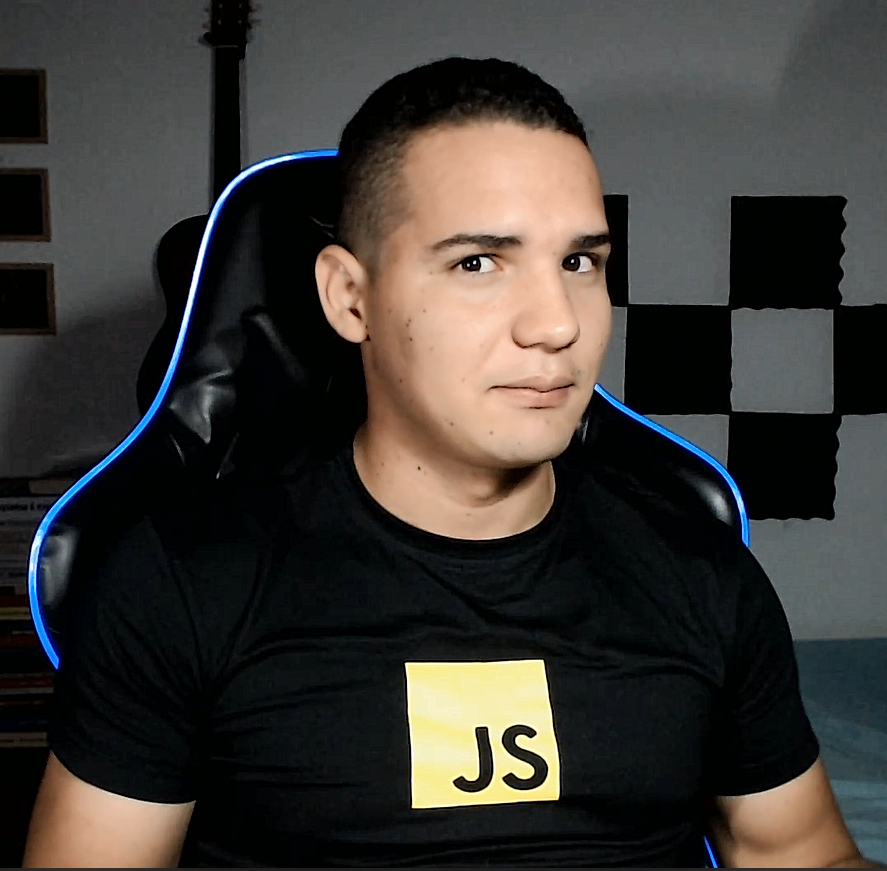

## Hello World!  It's me, [Hernán!](https://twitter.com/Hernan1ro)

I'm a Frontend developer specialized in [React](https://reactjs.org) with ♥. I'm  also a [JavaScript](https://www.javascript.com/) developer.

 

<!--   -->

 

## About me as a Dev

- 🔭 I’m currently creating with [HTML](https://html.com),[CSS](https://www.css.com/) & [JavaScript](https://www.javascript.com/) amazing projects that you can see [right here](https://github.com/Hernan1ro?tab=repositories)

- 🌱 I’m currently learning [React](https://reactjs.org).

- 💬 Creating content in [my blog](), [Twitch](https://twitch.hernan1ro.com) and [YouTube](https://www.youtube.com/channel/UCh6utMHB-06n4k6vUZC_hgA).

 

<!-- ## Languages and Tools -->
<h2 aling=center">Lenguages and tecnologies</h2>

<code></code>
<code></code>
<code></code>
<code></code>
<code></code>

---

<!--  -->
